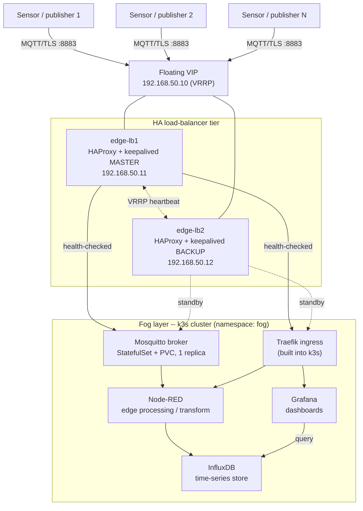

# Raspberry Pi / K3s IoT Edge-Fog Platform

A load-balanced K3s cluster on Raspberry Pi hardware, redesigned as a real
IoT edge/fog data platform: simulated sensors publish over MQTT, an
HAProxy + keepalived HA pair fronts the cluster, and Node-RED / InfluxDB /
Grafana turn the telemetry into dashboards.

This repo started from
[`load balancer with Rpi inside k3s clusters.ipynb`](load%20balancer%20with%20Rpi%20inside%20k3s%20clusters.ipynb),
an AI-assisted brainstorm for "a K3s cluster load-balanced with HAProxy,
fronting an Nginx web server". That notebook is kept for history, but it
does not run as written: it mixes two contradictory load-balancer designs,
uses a k3s command that does not exist, ships a HAProxy config with
copy-paste artifacts baked into it, and -- despite calling itself an
IoT/edge/fog project -- never actually touches an IoT protocol. The full
list is in [`docs/ERRATA.md`](docs/ERRATA.md): 13 issues in the original
concept, plus 3 more that were only caught by actually running the fixed
configuration through its real validators (`haproxy -c`, `keepalived -t`,
Kubernetes schema validation) rather than just reading it -- 16 findings
total, all fixed in what follows.

## Architecture



One external load-balancer boundary (HAProxy + keepalived, protocol-aware:
TCP passthrough for MQTT and HTTPS, plain HTTP redirect), one internal
ingress boundary (Traefik, already built into k3s), MQTT treated as the
stateful protocol it is (single broker, HA via k3s rescheduling rather than
naive round robin), and an actual telemetry pipeline behind it. Full
rationale, node roles and IP plan, and bring-up order:
[`docs/ARCHITECTURE.md`](docs/ARCHITECTURE.md).

## Repo layout

```
README.md                  -- you are here
docs/
  ERRATA.md                 -- what was wrong with the original concept (16 findings)
  ARCHITECTURE.md            -- corrected design, node roles, data flow, bring-up order
  SECURITY.md                -- firewall rules, MQTT auth, SSH hardening, cert commands
  TESTING.md                 -- test plan + how this repo's own configs were verified
  ALTERNATIVES.md             -- MetalLB/kube-vip, InfluxDB 2 vs 3, EMQX, k3s vs kubeadm, ...
  REFERENCES.md               -- sources for version- and config-specific claims
haproxy/haproxy.cfg          -- identical on both LB nodes
keepalived/                  -- keepalived-lb1-master.conf / keepalived-lb2-backup.conf
k8s/                          -- namespace, Traefik HelmChartConfig, Mosquitto, InfluxDB, Node-RED, Grafana, Ingress
scripts/
  setup-node.sh               -- Raspberry Pi OS prep + k3s install/join for fog nodes
  setup-lb-node.sh             -- haproxy/keepalived install + firewall for LB nodes
architecture.mmd              -- Mermaid source for the diagram above
```

## Quick start

1. Five Raspberry Pi boards (placeholders here: 4B, subnet
   `192.168.50.0/24` -- swap in your real hardware/IPs throughout).
2. Fog nodes (`fog-srv1`, `fog-agent1`, `fog-agent2`): run
   `scripts/setup-node.sh prep`, reboot, then `server` on the first and
   `agent <server-ip> <token>` on the other two.
3. Copy `k8s/05-traefik-config.yaml` onto `fog-srv1` at
   `/var/lib/rancher/k3s/server/manifests/traefik-config.yaml`, create the
   Secrets listed in [`docs/SECURITY.md`](docs/SECURITY.md), then
   `kubectl apply -f k8s/`.
4. LB nodes (`edge-lb1`, `edge-lb2`): run `scripts/setup-lb-node.sh`, copy
   `haproxy/haproxy.cfg` (identical on both) and the matching
   `keepalived/keepalived-lb*.conf`, validate with `haproxy -c` /
   `keepalived -t`, start both services.
5. Point `grafana.fog.local` / `nodered.fog.local` at the VIP
   (`192.168.50.10`) via `/etc/hosts` or local DNS.
6. Work through [`docs/TESTING.md`](docs/TESTING.md).

Full step-by-step: [`docs/ARCHITECTURE.md`](docs/ARCHITECTURE.md#bring-up-order).
