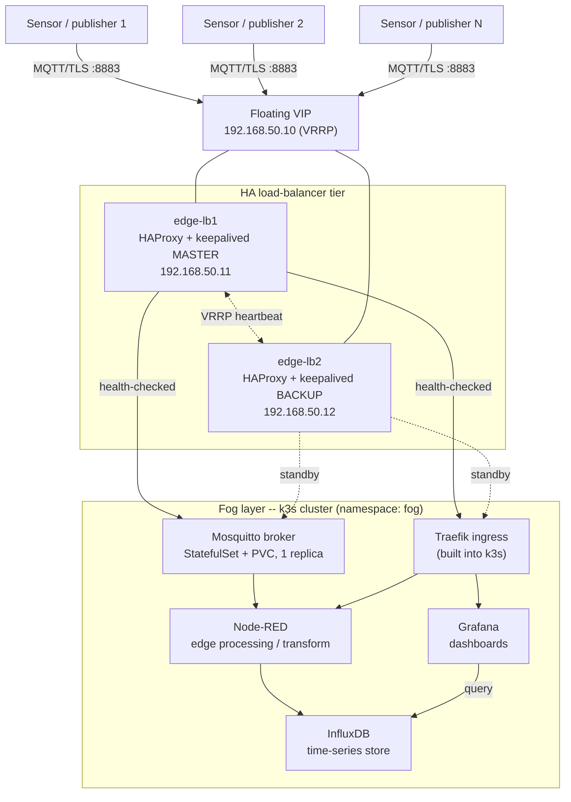

# Corrected Architecture

## Design principles

Four decisions drive the redesign, each tracing back to a specific item in
[`ERRATA.md`](ERRATA.md):

**One external load-balancer boundary, protocol-aware.** HAProxy + keepalived
(an active/passive pair sharing a VRRP floating IP) is the single entry point
from outside the fog cluster. It plainly redirects HTTP to HTTPS, passes
HTTPS through as opaque TCP (so it never needs the TLS private key), and
passes MQTT through in TCP mode -- three different frontends, each doing the
one job appropriate to its protocol, instead of one HTTP-only config applied
everywhere (fixes errata #3, #4, #7).

**One internal ingress boundary.** Traefik -- already built into k3s -- does
host-based HTTP routing once traffic is inside the cluster; kube-proxy
load-balances across whatever pod replicas sit behind each Service. That is
the complete chain: external LB -> ingress -> Service -> pod, with each layer
owning a distinct job instead of three tools fighting over the same one
(fixes errata #4, #8).

**MQTT treated as the stateful protocol it is.** The broker runs as a
single-replica StatefulSet with a persistent volume. High availability comes
from k3s rescheduling that pod and kube-proxy's NodePort fan-out continuing
to reach it wherever it lands -- not from round-robining several independent
broker processes, which would silently corrupt pub/sub session state (fixes
errata #7, #9).

**An IoT data path actually exists this time.** Simulated sensors publish
telemetry over MQTT; Node-RED subscribes and does the edge-processing
(filtering/transforming) that is the actual point of "edge computing";
InfluxDB stores the resulting series; Grafana dashboards it. This replaces
the original's generic Nginx placeholder page (fixes errata #9).

## Topology

(Source: [`architecture.mmd`](../architecture.mmd) -- GitHub renders the
block above directly; open the `.mmd` file if you want to re-render it
elsewhere, e.g. with `mmdc`.)

## Node roles

Realistic placeholders, not a real inventory -- swap in your own
hostnames/IPs when deploying.

| Node | Hostname | IP | Hardware | Role |
|---|---|---|---|---|
| edge-lb1 | edge-lb1.fog.local | 192.168.50.11 | Raspberry Pi 4B, 4GB | HAProxy + keepalived, MASTER |
| edge-lb2 | edge-lb2.fog.local | 192.168.50.12 | Raspberry Pi 4B, 4GB | HAProxy + keepalived, BACKUP |
| -- (VIP) | -- | 192.168.50.10 | -- (VRRP floating address) | Single address clients/sensors actually use |
| fog-srv1 | fog-srv1.fog.local | 192.168.50.21 | Raspberry Pi 4B/5, 8GB | k3s server (control-plane) |
| fog-agent1 | fog-agent1.fog.local | 192.168.50.22 | Raspberry Pi 4B, 4-8GB | k3s agent (worker) |
| fog-agent2 | fog-agent2.fog.local | 192.168.50.23 | Raspberry Pi 4B, 4-8GB | k3s agent (worker) |

Raspberry Pi 5 boards have a documented, firmware-dependent report of the
memory cgroup failing to enable even with correct boot parameters
([raspberrypi/linux#5933](https://github.com/raspberrypi/linux/issues/5933)).
If a fog node shows `failed to find memory cgroup (v2)` after following the
prep steps in `scripts/setup-node.sh`, update EEPROM firmware
(`sudo rpi-eeprom-update -a`) and retry, or use a Pi 4B for that node
instead.

## Data flow

**Telemetry path:** a sensor (or its simulator) publishes over MQTT/TLS to
the floating VIP on port 8883. HAProxy (whichever of edge-lb1/edge-lb2
currently holds the VIP) forwards this in TCP mode to Mosquitto's NodePort on
fog-srv1 by preference, falling back to the agent nodes' NodePorts only if
that path is unreachable -- kube-proxy resolves any of the three to wherever
the single broker pod actually lives. Node-RED, subscribed to the relevant
topics, transforms the readings and writes them to InfluxDB. Grafana queries
InfluxDB and renders the dashboard.

**Dashboard path:** a browser reaches the same VIP on port 443. HAProxy
passes the TLS stream through (adding PROXY-protocol-v2 so the real client IP
is preserved) to Traefik's NodePort, which terminates TLS and applies
host-based routing to the Grafana or Node-RED Service, which kube-proxy hands
to a pod.

## Bring-up order

1. Prep every fog node: `scripts/setup-node.sh prep` on fog-srv1, fog-agent1,
   fog-agent2; reboot each; confirm `/proc/cgroups` shows the memory
   controller enabled before continuing.
2. `scripts/setup-node.sh server` on fog-srv1. Note the node token it prints.
3. `scripts/setup-node.sh agent <fog-srv1-ip> <token>` on fog-agent1 and
   fog-agent2.
4. On fog-srv1 only: copy `k8s/05-traefik-config.yaml` to
   `/var/lib/rancher/k3s/server/manifests/traefik-config.yaml`.
5. Create the Secrets the manifests reference -- mosquitto-tls,
   mosquitto-passwd, influxdb-admin, grafana-admin, fog-dashboards-tls; exact
   commands in [`SECURITY.md`](SECURITY.md).
6. `kubectl apply -f k8s/00-namespace.yaml`, then `kubectl apply -f k8s/` for
   the rest.
7. On edge-lb1 and edge-lb2: `scripts/setup-lb-node.sh`, copy `haproxy.cfg`
   (identical on both) and the matching `keepalived-lb1-master.conf` /
   `keepalived-lb2-backup.conf`, validate with `haproxy -c` / `keepalived
   -t`, then start both services.
8. Point client machines' `/etc/hosts` (or a local dnsmasq/Pi-hole entry) at
   `grafana.fog.local` / `nodered.fog.local` -> `192.168.50.10`.
9. Run through [`TESTING.md`](TESTING.md).
